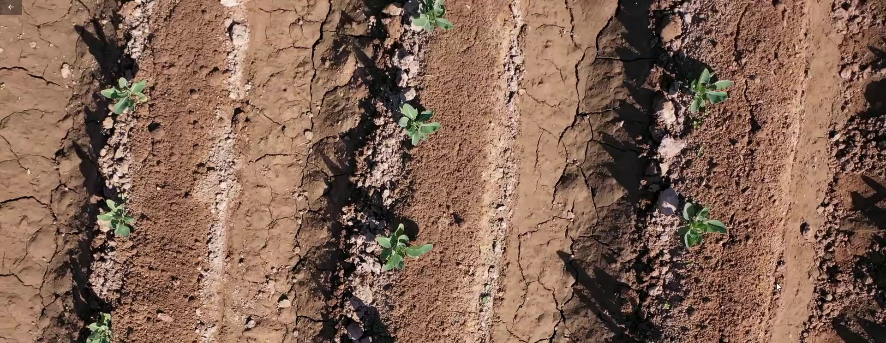
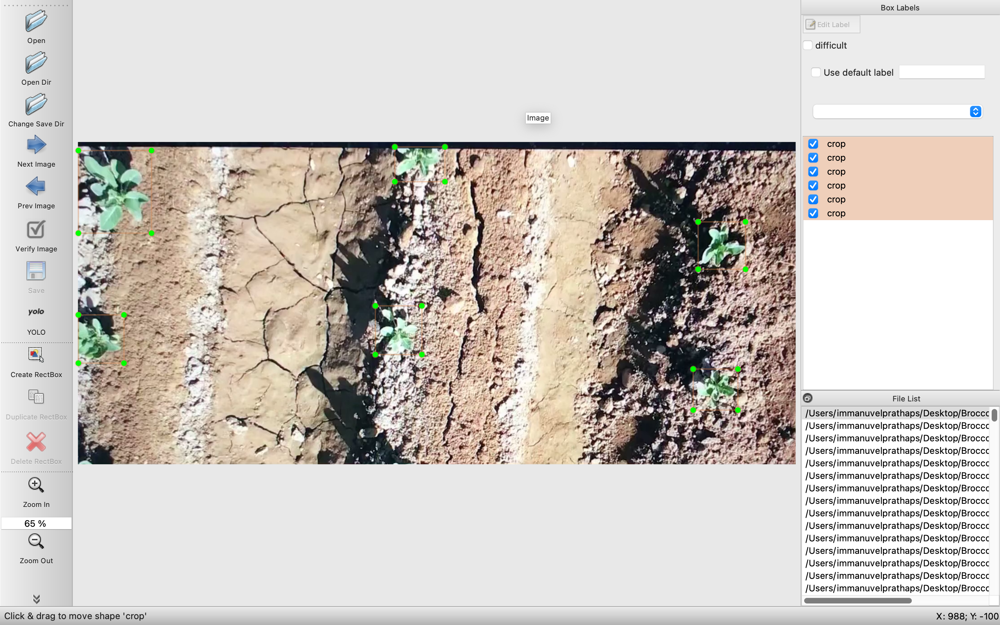
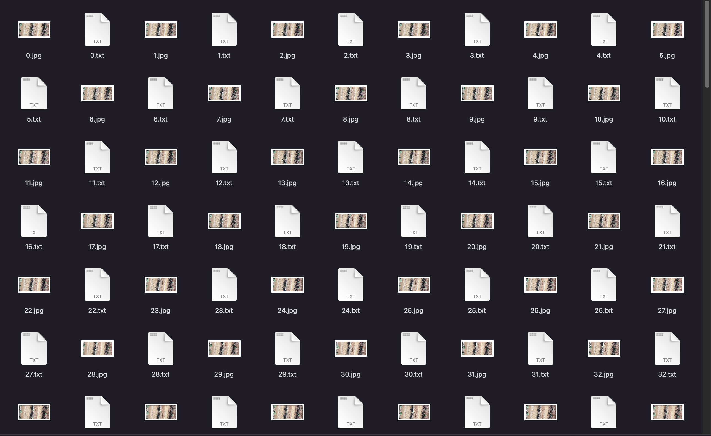

# Custom_Object_Detetection-Broccoli_Plant-DroneFootage

# In this Repo, I show you how computer vision and artificial intelligence can help improve production and save money. This is done by automating processes that normally have to be done by manual work. I will speak in particular of Agriculture plant analysis with the drone and Artificial Intelligence.

It doesn’t take a lot of imagination or skill in predicting the future to understand how artificial intelligence has entered all industries. In particular, 2021 is the year of agriculture, in this article [10 Ways AI Has The Potential To Improve Agriculture In 2021](https://www.forbes.com/sites/louiscolumbus/2021/02/17/10-ways-ai-has-the-potential-to-improve-agriculture-in-2021/?sh=472dfdee7f3b) forbs there are some possible applications. I will show you an example.
Intel with [Intel-Powered AI Helps Optimize Crop Yields](https://www.intel.it/content/www/it/it/big-data/article/agriculture-harvests-big-data.html) also makes us understand that the future is now. You can produce more with fewer resources.

# LET'S START!

- We will analyze a video footage over broccoli plantation with the aim of detecting the broccoli plant/crop to have an estimation of homogeneity in crop plants. 
- To make an estimate of homogeneity in cultivated plants, one would have to manually count thousands of plants with huge waste of time and the risk of error. Without considering the problem of photographing or checking plant by plant in order to verify the growth, if it is damaged or other parameters.
- Everything can be done by writing software that leverages computer vision and AI in real-time. Just fly the drone over the cultivated field.

# 1 Object detection
First, we need to recover a lot of images. We need to have all these images so that we can train any deep learning model to identify and cut out things that it has never seen before. There are many models of artificial intelligence and object detection, for this example I will use YOLOv3 because in this case, it is the easiest to use in a not particularly complex operation.

## Train the model
To make the artificial intelligence model recognize new objects, in our case YOLOv3, it is necessary to teach it what a broccoli is. You can find the python code to automatically extract the images from the video and save them in a folder here - (https://github.com/immanuvelprathap/Custom_Object_Detetection-Broccoli_Plant-DroneFootage/blob/main/data/video_to_frame.py).

To have a great result it is always necessary to have photos with different types of lighting, different positions, backgrounds and contexts. This must be done so that the drone can recognize plants even when it is cloudy or when there is a lot of light.

Now you need to use image labeling software to identify the location of each broccoli plant on the images we downloaded earlier from the video. This software generates a .txt file associated with each image in which it indicates the exact position of all the plants present in the image.

## Use the trained model

All this information must be passed to the training algorithm to make sure that the drone, thanks to artificial intelligence, recognizes the plants. In the photo here is the result.

# Play the Video to see the Results!

https://user-images.githubusercontent.com/68032323/148578694-f4f9c484-111f-42b8-addd-fa1342bedd0b.mp4

# COMING SOON...STAY TUNED!

### 2 Object Tracking
To associate a univocal ID to each crop

### 3 Object Counting
To count the crops

### 4 Take crops snapshots
To save the picture of every single crop

## Technologies Used

                               

                                                 

## Team

 

[Immanuvel Prathap's Website - Click Here!](https://immanuvelprathap.in/)

## License

## Credits

## References for researcher
[FarmBeats: AI, Edge & IoT for Agriculture](https://www.microsoft.com/en-us/research/project/farmbeats-iot-agriculture/)

[10 Ways AI Has The Potential To Improve Agriculture In 2021](https://www.forbes.com/sites/louiscolumbus/2021/02/17/10-ways-ai-has-the-potential-to-improve-agriculture-in-2021/?sh=472dfdee7f3b)

[Intel-Powered AI Helps Optimize Crop Yields](https://www.intel.it/content/www/it/it/big-data/article/agriculture-harvests-big-data.html)

